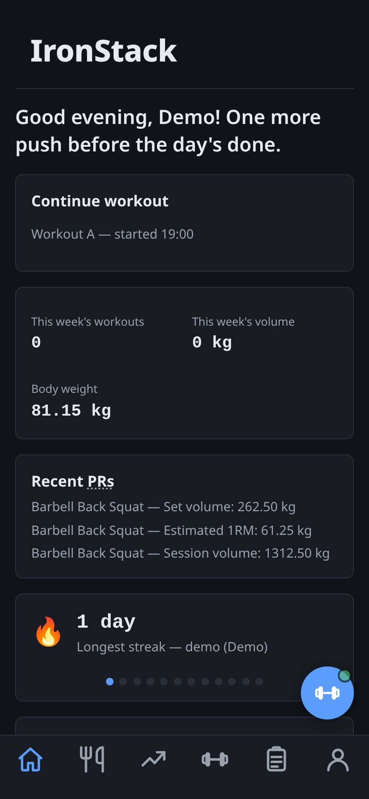
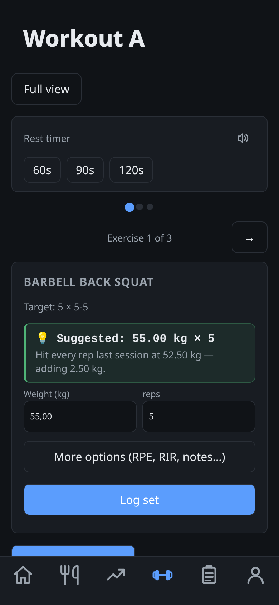
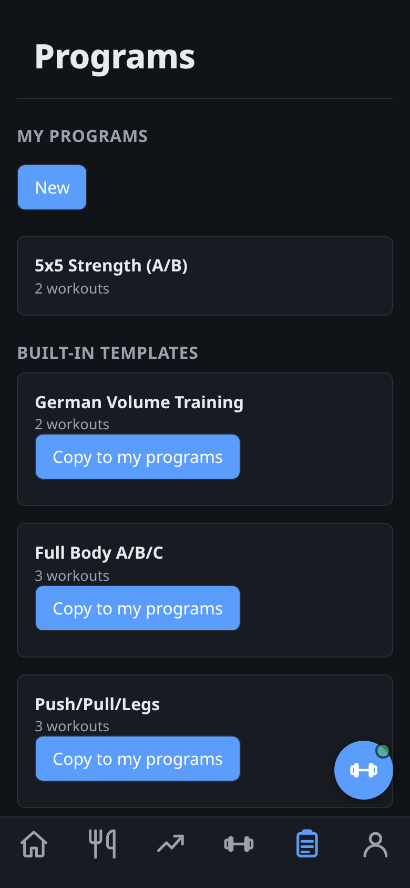
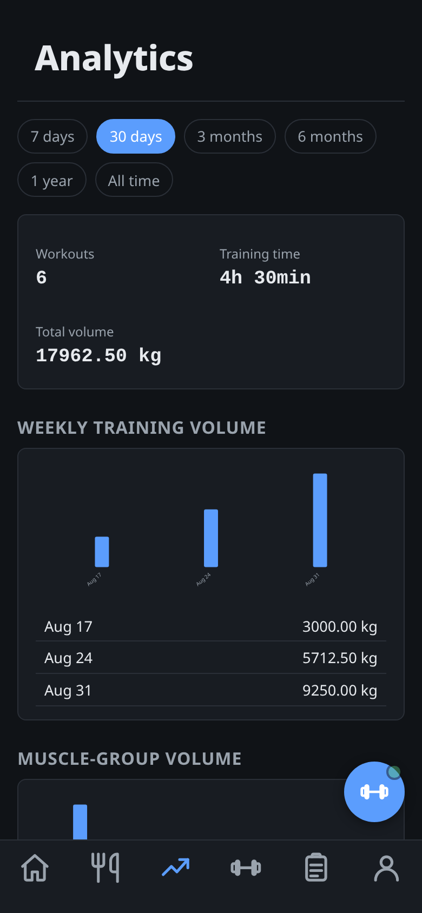
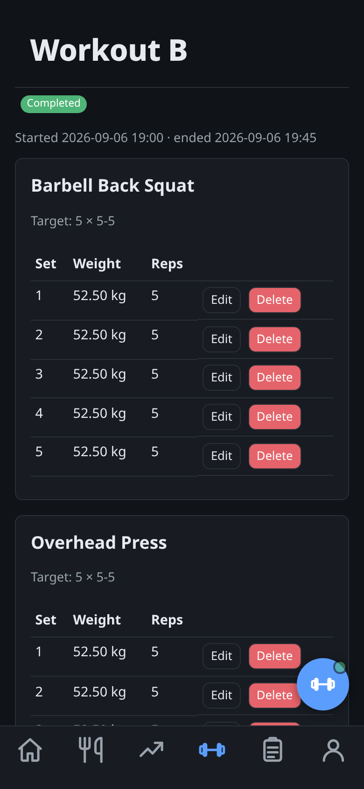

# IronStack

Self-hosted, mobile-first fitness and activity tracker — a training log
first, an intelligent assistant second. Log workouts, follow a program,
get explainable weight suggestions, track PRs automatically, and see
your progress in real charts — all on your own infrastructure.

[](https://github.com/JonneSaloranta/ironstack/actions/workflows/ci.yml)
[](LICENSE)
[](https://www.python.org/)
[](https://www.djangoproject.com/)
[](docs/ARCHITECTURE.md#internationalization)

## Features

- **Workout logging** — fast, HTMX-driven set entry that pre-fills from
  your last set; works fully as plain forms with JavaScript off, too.
- **Programs & templates** — build your own program or start from a
  built-in template (5×5, Push/Pull/Legs, Arnold Split, ...); copying a
  template never touches the original, and editing a program never
  rewrites history already logged against it.
- **Automatic PR detection** — max weight, rep PRs, estimated 1RM, set
  and session volume, detected live off your real history, no caching.
- **Explainable smart weight suggestions** — seven progression methods
  (linear, double progression, RPE/RIR, percentage-based, ...), always
  shown with a plain-language reason and confidence — always just a
  form default you can override, never a decision made for you.
- **Body & activity tracking** — measurements (weight, body fat %,
  circumferences, ...) and manually logged activities (runs, rides,
  anything), each with its own trend chart.
- **Nutrition & calorie tracking** — an explainable calorie/macro
  estimate, goal-based targets with a dynamic adjustment suggestion
  once your real weight trend has something to compare against, a
  food diary backed by on-demand OpenFoodFacts lookup (search, browse
  by category, or scan a barcode with your camera), recipes with
  automatic macros, and a guided diet-plan builder. See
  [`docs/NUTRITION.md`](docs/NUTRITION.md).
- **Analytics dashboard** — weekly training volume, muscle-group
  volume, PR history, per-exercise strength trends, custom date
  ranges, and a 30-day nutrition trend alongside them.
- **A real API** — per-user API keys with per-resource CRUD
  permissions and admin-tunable rate limits, for anything you want to
  build against your own data. See [`docs/API.md`](docs/API.md).
- **Installable PWA** — add it to your home screen; static assets are
  cached for speed, but nothing about your actual training data ever
  is, so you never see stale history.
- **Automatic backups** — a daily scheduled backup plus an admin-only
  web UI and host-side scripts to create, download, and restore full
  backups on demand. See [`docs/BACKUP.md`](docs/BACKUP.md).
- **Translated** — English, Finnish, Swedish, Russian, Italian, and
  Estonian, UI chrome and seeded content alike.

## Screenshots

Mobile-first, so this is what it actually looks like day to day —
the bottom nav and every page below render the same on a real phone.

<table>
<tr>
<td width="20%"></td>
<td width="20%"></td>
<td width="20%"></td>
<td width="20%"></td>
<td width="20%"></td>
</tr>
<tr>
<td align="center">Dashboard</td>
<td align="center">Training mode</td>
<td align="center">Programs</td>
<td align="center">Analytics</td>
<td align="center">Session history</td>
</tr>
</table>

## Quick start

```bash
git clone https://github.com/JonneSaloranta/ironstack.git
cd ironstack
cp .env.example .env
docker compose up --build
```

Open **http://localhost:8000** (nginx also fronts it on **http://localhost**).
Then create an admin account:

```bash
docker compose exec web python manage.py createsuperuser
```

That's it — PostgreSQL, migrations, and the Django dev server (with
auto-reload) are all running. The default `.env` works out of the box
for local development; nothing needs editing to get started.

### Without Docker

```bash
python3.14 -m venv .venv
source .venv/bin/activate
pip install -r requirements/dev.txt
cp .env.example .env   # set POSTGRES_HOST=localhost
python manage.py migrate
python manage.py runserver
```

A host venv like this one drifts out of sync in ways Docker never does
— `requirements/dev.txt` grows a package nobody re-installed for, or
`pg_dump` is missing/the wrong major version (needed for
`apps.core.backups`' web-UI backups, not just `scripts/backup.sh`).
Both fail tests in a way that looks like an unrelated regression.
Run `./scripts/check-dev-env.sh` any time a fresh `pytest` run fails
tests you didn't touch — it re-syncs installed packages and checks
`pg_dump` for you, with exact fix commands if either is off.

## Tech stack

| Layer | Choice |
|---|---|
| Backend | Python, Django, PostgreSQL |
| Frontend | Django Templates, HTMX, Alpine.js — server-rendered first, no SPA framework |
| API | Django REST Framework, API-key auth, per-key rate limiting |
| Deployment | Docker Compose — app, PostgreSQL, reverse proxy (nginx, or Caddy for automatic TLS) |
| i18n | Django's own gettext catalogs — no third-party translation library |

No JavaScript build step, no Node dependency, no SPA framework — pages
render on the server; HTMX and Alpine.js add just the interactivity a
given page actually needs.

## Documentation

| Doc | Covers |
|---|---|
| [`docs/PRODUCT_REQUIREMENTS.md`](docs/PRODUCT_REQUIREMENTS.md) | The original product spec |
| [`docs/ARCHITECTURE.md`](docs/ARCHITECTURE.md) | App structure, stack decisions, versioning |
| [`docs/DOMAIN_MODEL.md`](docs/DOMAIN_MODEL.md) | The core data model |
| [`docs/DEVELOPMENT.md`](docs/DEVELOPMENT.md) | Phase-by-phase implementation plan and acceptance criteria |
| [`docs/PROGRESSION.md`](docs/PROGRESSION.md) | The seven progression methods |
| [`docs/SMART_SUGGESTIONS.md`](docs/SMART_SUGGESTIONS.md) | How weight suggestions are composed and explained |
| [`docs/PR_SYSTEM.md`](docs/PR_SYSTEM.md) | The six PR types and how they're detected |
| [`docs/NUTRITION.md`](docs/NUTRITION.md) | Calorie/macro engine, food diary, recipes, diet plans, OpenFoodFacts integration |
| [`docs/ANALYTICS.md`](docs/ANALYTICS.md) | Dashboard, charts, date-range filtering |
| [`docs/API.md`](docs/API.md) | REST API — auth, permissions, rate limits, endpoints |
| [`docs/UI.md`](docs/UI.md) | UI principles and per-feature implementation notes |
| [`docs/SECURITY.md`](docs/SECURITY.md) | TLS, email, rate limiting, CSP, and everything else before going to production |
| [`docs/BACKUP.md`](docs/BACKUP.md) | Backup/restore, both mechanisms, in full |
| [`docs/ROADMAP.md`](docs/ROADMAP.md) | What's deliberately not built yet, and why |
| [`docs/DEVELOPMENT_LOG.md`](docs/DEVELOPMENT_LOG.md) | The detailed, ongoing build history |
| [`CHANGELOG.md`](CHANGELOG.md) | What changed, by version |
| [`CLAUDE.md`](CLAUDE.md) | Project conventions and guidelines for AI-assisted development |

## Testing & linting

```bash
ruff check .
pytest
```

[`.github/workflows/ci.yml`](.github/workflows/ci.yml) runs the same
two checks — plus a missing-migrations check and compiling the locale
catalogs first — on every push and pull request against `master` and
`dev`, against a real `postgres:16-alpine` service container.
[`.github/dependabot.yml`](.github/dependabot.yml) opens a weekly,
reviewed PR for outdated pip/Docker/GitHub Actions dependencies, still
gated by that same CI.

## Production deployment

`docker-compose.override.yml` is a **local development** file Docker
Compose merges in automatically — do not ship it to a server. On the
production host, only `docker-compose.yml` should be present, with
`.env` set to real secrets, `DJANGO_ALLOWED_HOSTS`, etc.

`.github/workflows/ci.yml` publishes a production image to GitHub
Container Registry (`ghcr.io/jonnesaloranta/ironstack`, tagged
`:latest` and `:<VERSION>`) on every push to master that passes CI —
`docker-compose.yml` already points at it, so the normal deploy is
just pulling and starting, no build step on the server at all:

```bash
docker compose -f docker-compose.yml pull
docker compose -f docker-compose.yml up -d
```

Pin a specific released version instead of always the latest push by
setting `IRONSTACK_IMAGE_TAG` in `.env` (see `.env.example`). If the
GHCR package is private, `docker login ghcr.io` on the host first.

### Updating

Same two commands as the initial deploy above — pull the new image,
then recreate the container with it:

```bash
docker compose -f docker-compose.yml pull
docker compose -f docker-compose.yml up -d
```

No extra manual step needed for a routine update: the image's own
startup sequence (`docker-entrypoint.sh`) already runs `migrate`,
`collectstatic`, and `compilemessages` every time the `web` container
starts, so schema changes, new static assets, and updated translations
all apply automatically on the new version's first start — and, since
that sequence is baked into the image itself rather than
`docker-compose.yml`, a future step added to it arrives with the pull
above too, with no separate file on this server to also keep in sync.
Existing data (`postgres_data`/`static_data`/`media_data`/
`backups_data` volumes) isn't touched by recreating the container.

One exception the two commands above don't cover: a change to
`compose/nginx/nginx.conf` itself (a real one shipped once — adding
gzip compression). `nginx`'s `image:` tag never changes on an update,
and Compose's own recreate check doesn't look inside a bind-mounted
file's *contents* — only at whether the image or the `docker-
compose.yml` service definition around it changed — so `up -d` alone
leaves the `nginx` container running on whatever config it already had
in memory. Worse than a no-op: `nginx.conf` is mounted as a *single
file*, and editors/`git` typically replace a file by writing a new
inode rather than editing the old one in place, which can leave the
bind mount itself pointing at a now-deleted inode — so even `docker
compose exec nginx nginx -s reload` (which only re-reads config, not
the mount) isn't guaranteed to see the new file either. After any
update that touched `compose/nginx/nginx.conf`, force nginx to pick up
its current on-disk config by recreating the container outright:
`docker compose -f docker-compose.yml up -d --force-recreate nginx`.

Still worth doing before any update, as routine hygiene rather than
because the automatic part is untrustworthy: take a fresh backup first
(the profile page's admin-only Backups screen, or `./scripts/backup.sh`
— see [`docs/BACKUP.md`](docs/BACKUP.md)), and skim
[`CHANGELOG.md`](CHANGELOG.md) for anything under "Changed"/"Removed"
if you're jumping more than one version at once — a deliberately
breaking change (a newly *required* setting with no default, a manual
one-time step) would be called out there rather than assumed silent.

**Before your first deploy, read [`docs/SECURITY.md`](docs/SECURITY.md)'s
"TLS" section** — the bundled nginx config is HTTP-only, and the
default `DJANGO_SECURE_SSL_REDIRECT=true` will redirect-loop until you
either add TLS (`docker-compose.tls.yml` is a ready-to-use overlay for
that) or explicitly opt out.

Prefer building locally instead of pulling? That still works
unchanged:

```bash
docker compose -f docker-compose.yml up -d --build
```

or, for the same version/git-commit/build-date metadata the published
image gets baked into its OCI labels (see `docs/ARCHITECTURE.md`
"Versioning"), build with `scripts/build.sh` first, then start without
`--build`:

```bash
./scripts/build.sh
docker compose -f docker-compose.yml up -d
```

Backups run automatically once a day out of the box
(`docker-compose.yml`'s `backup-scheduler` service) — see
[`docs/BACKUP.md`](docs/BACKUP.md) for the full picture, including the
admin-only web UI and host-side scripts for on-demand ones.

## Project history

`README.md` (this file) stays a short orientation. For the detailed
story of how each feature was actually built — including bugs found
and fixed along the way — see
[`docs/DEVELOPMENT_LOG.md`](docs/DEVELOPMENT_LOG.md). For a terse,
version-bucketed summary of what changed, see
[`CHANGELOG.md`](CHANGELOG.md).

## License

[GNU AGPLv3](LICENSE) — see [`LICENSE`](LICENSE) for the full text.
